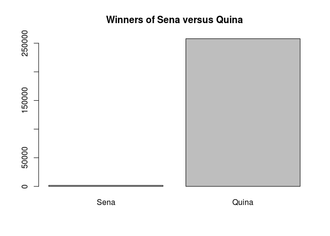

R Explorating
================
Rony Silva
25/10/2019

Hi, I am Ronyberque C. Silva, a student of Msc. on Informatics on
University Federal of Alagoas - UFAL, on Brazil. In this article, I show
the use of some functions of R.

### Choose Dataset

The Dataset choose was a dataset that contains all sweepstakes of
Mega-Sena (a lotery of Brazil). The dataset was downloaded from
[Kaggle.com](https://www.kaggle.com) and has tunned to this example.
Link to download.
<https://www.kaggle.com/viniciusbbizarri/sorteiosmegasena>.

``` r
library(dplyr)
```

    ## 
    ## Attaching package: 'dplyr'

    ## The following objects are masked from 'package:stats':
    ## 
    ##     filter, lag

    ## The following objects are masked from 'package:base':
    ## 
    ##     intersect, setdiff, setequal, union

``` r
library(ggplot2)
```

### Define path of Datasets

Below i define the path of used datasets

``` r
path <- "/home/rony/Documentos/data-analysis/Datasets/"
```

### Import Dataset

R allows that the developer can import data from a CSV and other
extensions. CSV files without header can take ignore header using the
param ‘header=FALSE’. On default, ‘header=TRUE’, like you see below.

``` r
sorteios = read.csv(paste(path,"sorteios.csv",sep=""),header=TRUE)
```

I’m specialy interested on obtain informations related to winners of
Sena. Bellow, i am start to refine the content of dataset choised.

## Explorating dataset through R functions

### str Function

The use of ‘str’ function, allows that the structure of an object R can
be exposed. This function allows show basically the structure of the
assigned object but in resume.

``` r
str(sorteios)
```

    ## 'data.frame':    2278 obs. of  23 variables:
    ##  $ Id                      : int  1 2 3 4 5 6 7 8 9 10 ...
    ##  $ Concurso                : int  1 2 3 3 4 5 6 7 8 9 ...
    ##  $ Data.Sorteio            : Factor w/ 2062 levels "01/02/1998","01/02/2003",..: 695 1173 1656 1656 14 489 973 1452 1907 357 ...
    ##  $ X1ª.Dezena              : int  41 9 36 36 6 1 19 56 53 55 ...
    ##  $ X2ª.Dezena              : int  5 39 30 30 59 19 40 38 17 43 ...
    ##  $ X3ª.Dezena              : int  4 37 10 10 42 46 7 21 38 56 ...
    ##  $ X4ª.Dezena              : int  52 49 11 11 27 6 13 20 4 54 ...
    ##  $ X5ª.Dezena              : int  30 43 29 29 1 16 22 3 47 8 ...
    ##  $ X6ª.Dezena              : int  33 41 47 47 5 2 47 5 37 60 ...
    ##  $ Arrecadacao_Total       : Factor w/ 993 levels "0,00","100.622.977,50",..: 1 1 1 1 1 1 1 1 1 1 ...
    ##  $ Ganhadores_Sena         : int  0 1 2 2 0 0 0 0 0 0 ...
    ##  $ Cidade                  : Factor w/ 211 levels "","ÁGUA BRANCA",..: 1 1 1 1 1 1 1 1 1 1 ...
    ##  $ UF                      : Factor w/ 27 levels "","AC","AL","AM",..: 1 18 20 26 1 1 1 1 1 1 ...
    ##  $ Rateio_Sena             : Factor w/ 486 levels "0,00","10.000.441,74",..: 1 194 330 330 1 1 1 1 1 1 ...
    ##  $ Ganhadores_Quina        : int  17 65 62 62 39 98 109 100 60 17 ...
    ##  $ Rateio_Quina            : Factor w/ 2062 levels "10.009,69","10.013,62",..: 1570 384 43 43 472 1748 1882 1981 542 1804 ...
    ##  $ Ganhadores_Quadra       : int  2016 4488 4261 4261 3311 5399 7147 5736 5262 2175 ...
    ##  $ Rateio_Quadra           : Factor w/ 2019 levels "1.002,65","1.002,80",..: 1126 561 212 212 375 2005 44 208 391 1482 ...
    ##  $ Acumulado               : Factor w/ 2 levels "NÃO","SIM": 2 1 1 1 2 2 2 2 2 2 ...
    ##  $ Valor_Acumulado         : Factor w/ 1578 levels "0,00","10.016.284,93",..: 419 1 1 1 1411 217 682 1056 1211 1321 ...
    ##  $ Estimativa_Prêmio       : Factor w/ 150 levels "0,00","1.000.000,00",..: 1 1 1 1 1 1 1 1 1 1 ...
    ##  $ Acumulado_Mega_da_Virada: Factor w/ 1061 levels "0,00","10.081.237,88",..: 1 1 1 1 1 1 1 1 1 1 ...
    ##  $ X                       : logi  NA NA NA NA NA NA ...

### glimpse Function

The ‘glimpse’ function is like an ‘str’, but, basically with the
difference that ‘glimpse’ try to show all structure of assign object.

  - On the show, rows are attributes and columns are data of these
    attributes.
  - Glimpse allows that the developer can inform of the second param of
    function, the limit of data to show. On default, the ‘width’ param
    (second param), is the width of the console.

<!-- end list -->

``` r
glimpse(sorteios)
```

    ## Observations: 2,278
    ## Variables: 23
    ## $ Id                       <int> 1, 2, 3, 4, 5, 6, 7, 8, 9, 10, 11, 12, …
    ## $ Concurso                 <int> 1, 2, 3, 3, 4, 5, 6, 7, 8, 9, 10, 11, 1…
    ## $ Data.Sorteio             <fct> 11/03/1996, 18/03/1996, 25/03/1996, 25/…
    ## $ X1ª.Dezena               <int> 41, 9, 36, 36, 6, 1, 19, 56, 53, 55, 25…
    ## $ X2ª.Dezena               <int> 5, 39, 30, 30, 59, 19, 40, 38, 17, 43, …
    ## $ X3ª.Dezena               <int> 4, 37, 10, 10, 42, 46, 7, 21, 38, 56, 1…
    ## $ X4ª.Dezena               <int> 52, 49, 11, 11, 27, 6, 13, 20, 4, 54, 5…
    ## $ X5ª.Dezena               <int> 30, 43, 29, 29, 1, 16, 22, 3, 47, 8, 21…
    ## $ X6ª.Dezena               <int> 33, 41, 47, 47, 5, 2, 47, 5, 37, 60, 38…
    ## $ Arrecadacao_Total        <fct> "0,00", "0,00", "0,00", "0,00", "0,00",…
    ## $ Ganhadores_Sena          <int> 0, 1, 2, 2, 0, 0, 0, 0, 0, 0, 0, 1, 0, …
    ## $ Cidade                   <fct> , , , , , , , , , , , , , , , , , , , ,…
    ## $ UF                       <fct> , PR, RN, SP, , , , , , , , RJ, , , , ,…
    ## $ Rateio_Sena              <fct> "0,00", "2.307.162,23", "391.192,51", "…
    ## $ Ganhadores_Quina         <int> 17, 65, 62, 62, 39, 98, 109, 100, 60, 1…
    ## $ Rateio_Quina             <fct> "39.158,92", "14.424,02", "10.515,93", …
    ## $ Ganhadores_Quadra        <int> 2016, 4488, 4261, 4261, 3311, 5399, 714…
    ## $ Rateio_Quadra            <fct> "330,21", "208,91", "153,01", "153,01",…
    ## $ Acumulado                <fct> SIM, NÃO, NÃO, NÃO, SIM, SIM, SIM, SIM,…
    ## $ Valor_Acumulado          <fct> "1.714.650,23", "0,00", "0,00", "0,00",…
    ## $ Estimativa_Prêmio        <fct> "0,00", "0,00", "0,00", "0,00", "0,00",…
    ## $ Acumulado_Mega_da_Virada <fct> "0,00", "0,00", "0,00", "0,00", "0,00",…
    ## $ X                        <lgl> NA, NA, NA, NA, NA, NA, NA, NA, NA, NA,…

Then, how can be visualized, the chosen dataset contains 11 features
(columns) and 2278 points of data (rows). 2278 registers of sweepstakes
since 1996 to final of 2018.

### table Function

The function ‘table’ allows that the developer can show features of
dataset using a filter, for instance. One of the features of the dataset
‘sorteios’, is the ‘Ganhadores\_Sena’. How can see bellow. R allows
summarizing information of a specific feature only using ‘$’ and passing
the feature name (in this case, Ganhadores\_Sena) existent on dataset.

``` r
table(sorteios$Ganhadores_Sena)
```

    ## 
    ##    0    1    2    3    4    5    6    7   15   17 
    ## 1577  357  170   69   44   10   12    7   15   17

How can see, many observations contains instances that not have winners,
and how i am interested only sweepstakes that contains leastwise one
winner on Sena, then i decided filter my object sorteios and return only
instances that contains Ganhadores\_Sena \> 0.

``` r
onlyWithSenaWinners <- filter(sorteios, Ganhadores_Sena > 0)
```

The result can be viewed bellow…

``` r
table(onlyWithSenaWinners$Ganhadores_Sena)
```

    ## 
    ##   1   2   3   4   5   6   7  15  17 
    ## 357 170  69  44  10  12   7  15  17

How can be viewed above, 357 observations had one winner on “Sena”, for
instance. The representation above stills need detail the total of
winners, because that filter applied only show the total of instances
that are framed on the filter. Below a sum of data points to each
instance is applied.

### Ploting Graphs

On R, the graph plotting is easy to be used. On r-graph-gallery
(\[<https://www.r-graph-gallery.com/>\]), a lot of graphs and how can be
used, can be viewed.

Below, I use a graph bar to confront the total of winners on “Sena”
versus “Quina”.

``` r
totalWinnersSena = sum(onlyWithSenaWinners$Ganhadores_Sena)
totalWinnersQuina = sum(onlyWithSenaWinners$Ganhadores_Quina)
totalWinnersQuadra = sum(onlyWithSenaWinners$Ganhadores_Quadra)


barplot(height=c(totalWinnersSena,totalWinnersQuina), names=c("Sena","Quina"), main="Winners of Sena versus Quina")
```

<!-- --> \#\#\#
Correlations between Sena, Quina and Quadra The correlation test is used
to verify the association between two or more variables. Here is used to
verify the correlation between winners of Sena and
Quina.

``` r
  correlation <- cor.test(onlyWithSenaWinners$Ganhadores_Sena, onlyWithSenaWinners$Ganhadores_Quina,  method="kendall")
  correlation
```

    ## 
    ##  Kendall's rank correlation tau
    ## 
    ## data:  onlyWithSenaWinners$Ganhadores_Sena and onlyWithSenaWinners$Ganhadores_Quina
    ## z = 13.728, p-value < 2.2e-16
    ## alternative hypothesis: true tau is not equal to 0
    ## sample estimates:
    ##       tau 
    ## 0.3924656

Then, how can be viewed above, the correlation between winners of Sena
and Quina is very low (More winners of quina does not necessarily
increase the number of seine winners on
sena).

``` r
  correlation2 <- cor.test(onlyWithSenaWinners$Ganhadores_Quina, onlyWithSenaWinners$Ganhadores_Quadra,  method="kendall")
  correlation2
```

    ## 
    ##  Kendall's rank correlation tau
    ## 
    ## data:  onlyWithSenaWinners$Ganhadores_Quina and onlyWithSenaWinners$Ganhadores_Quadra
    ## z = 30.614, p-value < 2.2e-16
    ## alternative hypothesis: true tau is not equal to 0
    ## sample estimates:
    ##       tau 
    ## 0.7755197
